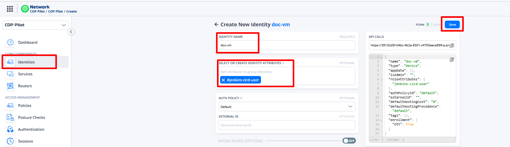
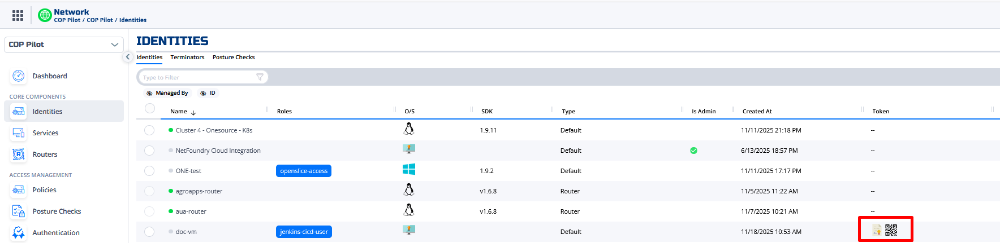
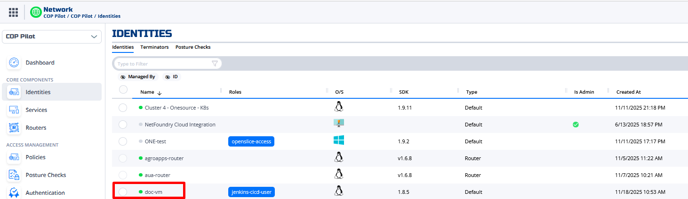
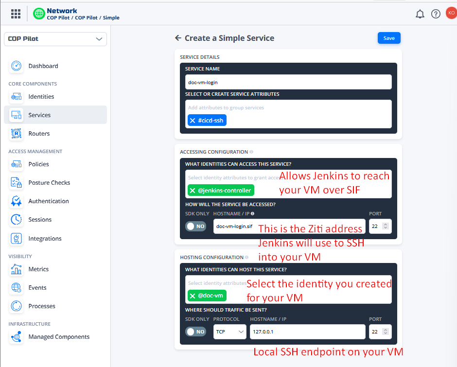

# COP-PILOT CI/CD – Partner VM Onboarding Guide

This guide explains how to connect your VM to the COP-PILOT CI/CD stack so Jenkins can execute pipelines on your machine over the SIF (OpenZiti) network.

⏱️Estimated completion time: ~15 minutes

---

## 1. 🆔 Create an Identity for Your VM in CloudZiti

1. Open the CloudZiti console:  
   **https://cop-pilot.cloudziti.io**

2. Go to **Identities → Create New Identity**.

3. Fill in:
   - **Name:** any meaningful name for your VM (e.g. `doc-vm`).
   - **Attributes:** add  
     ```text
     jenkins-cicd-user
     ```
4. Click **Save**.

<p align="center">
  
</p>

After saving, the identity will have a **JWT enrollment token** available for download.

5. Back in the **Identities** list, click the three dots (…) for your new identity and download the **enrollment JWT**.

<p align="center">
  
</p>

You’ll use this file on your VM to enroll the identity.

---

## 2. 🧩 Install Ziti Edge Tunnel and Enroll the Identity on Your VM

###  2.1 📥 Copy the JWT to Your VM

On your local machine, copy the downloaded `.jwt` file to your VM (e.g. using `scp` or `sftp`), into the `~/ziti` directory:

```bash
mkdir -p ~/ziti
# example from your laptop:
# scp doc-vm.jwt user@your-vm:~/ziti/
```

We will assume the file is now:

```text
~/ziti/<identity-name>.jwt
```

For example:

```text
~/ziti/doc-vm.jwt
```

---

### 2.2 📦 Install prerequisites

On your VM:

```bash
sudo apt update
sudo apt install -y openjdk-21-jdk unzip
```

---

### 2.3 ⬇️ Download the Ziti Edge Tunnel binary

```bash
cd ~/ziti

# Download a specific release of the Linux x86_64 tunnel
curl -L -o ziti-edge-tunnel.zip   https://github.com/openziti/ziti-tunnel-sdk-c/releases/download/v1.7.12/ziti-edge-tunnel-Linux_x86_64.zip

# Unzip it
unzip ziti-edge-tunnel.zip
```

You should now see a `ziti-edge-tunnel` binary in the folder:

```bash
ls
# <identity-name>.jwt  ziti-edge-tunnel  ziti-edge-tunnel.zip
```

Move it into your `PATH` and make it executable:

```bash
sudo mv ./ziti-edge-tunnel /usr/local/bin/
sudo chmod +x /usr/local/bin/ziti-edge-tunnel
```

Verify:

```bash
ziti-edge-tunnel version
```

You should see a version string (for example `v1.7.12`).

---

### 2.4 🔐 Enroll your identity

From `~/ziti`:

```bash
cd ~/ziti

ziti-edge-tunnel enroll   -j <identity-name>.jwt   -i <identity-name>.json
```

Example:

```bash
ziti-edge-tunnel enroll   -j doc-vm.jwt   -i doc-vm.json
```

If enrollment is successful, you will see a new `.json` file:

```bash
ls
# doc-vm.jwt  doc-vm.json  ziti-edge-tunnel.zip
```

This `.json` file is the enrolled identity that the tunnel will use.

---

### 2.5 🚀 Run the tunnel in the background

Start the tunnel as a background process:

```bash
sudo nohup ziti-edge-tunnel run -i ~/ziti/<identity-name>.json   > ~/ziti/ziti-<identity-name>.log 2>&1 &
```

Example:

```bash
sudo nohup ziti-edge-tunnel run -i ~/ziti/doc-vm.json   > ~/ziti/ziti-doc-vm.log 2>&1 &
```

Check that it is running:

```bash
ps aux | grep ziti-edge-tunnel
```


Finally, you can verify in the CloudZiti GUI that your identity is **Online** (green dot).

<p align="center">
  
</p>

---

## 3. 🔧 Create an OpenZiti Service so Jenkins Can SSH into Your VM

Now that your VM identity is enrolled and online, the next step is to **expose SSH on your VM through OpenZiti**, so that the Jenkins controller can connect securely without any public IP or firewall changes.

### 3.1 Create the SSH service

In the CloudZiti console:

1. Go to **Services → Create New Service → Create Simple Service**.

2. Fill in the form as follows:

- **Service Name:**
  ```text
  doc-vm-login
  ```

- **Service Attributes:**
  ```text
  cicd-ssh
  ```

- **Accessing Configuration → What identities can access this service?**  
  Add:
  ```text
  jenkins-controller
  ```

- **How will the service be accessed?**
  - SDK only: **No**
  - Hostname:  
    ```text
    doc-vm-login.sif
    ```
  - Port:  
    ```text
    22
    ```

- **Hosting Configuration → What identities can host this service?**  
  Add:
  ```text
  doc-vm
  ```

- **Where should traffic be sent?**
  - Protocol: **TCP**
  - Hostname:  
    ```text
    127.0.0.1
    ```
  - Port:  
    ```text
    22
    ```

3. Click **Save**.

<p align="center">
  
</p>

---

## 4. 👤 Create the Jenkins User and Configure SSH Access

### 4.1 Create the user

```bash
sudo useradd -m -s /bin/bash jenkins
sudo visudo
Add this line under the root entry:
jenkins ALL=(ALL) NOPASSWD:ALL
save and exit
sudo usermod -aG docker jenkins
sudo su - jenkins
mkdir -p ~/pipelines
```

### 4.2 Add the Jenkins controller public key

```bash
mkdir -p ~/.ssh
chmod 700 ~/.ssh
nano ~/.ssh/authorized_keys
```

Paste:

```text
ssh-ed25519 AAAAC3NzaC1lZDI1NTE5AAAAIF572Y7VrEOoIisdwTwkJlQzTjM2Q4SXYxpB3oFaSRXR coppilot-admin@cop-pilot-cicd
```

Fix permissions:

```bash
chmod 600 ~/.ssh/authorized_keys
```

---

## 5. 🔗 Final Step – Register Your VM as a Jenkins Node

Once everything is set up, email:

**konstantinos.fragkos@netcompany.com**

Include:
- Your VM identity name (e.g. `doc-vm`)
- Your service name (e.g. `doc-vm-login`)

You will then be added as a Jenkins node and can run pipelines against your VM.

---
